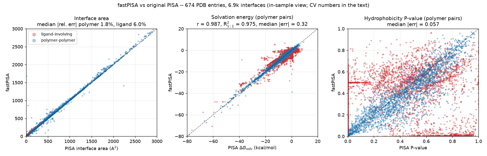
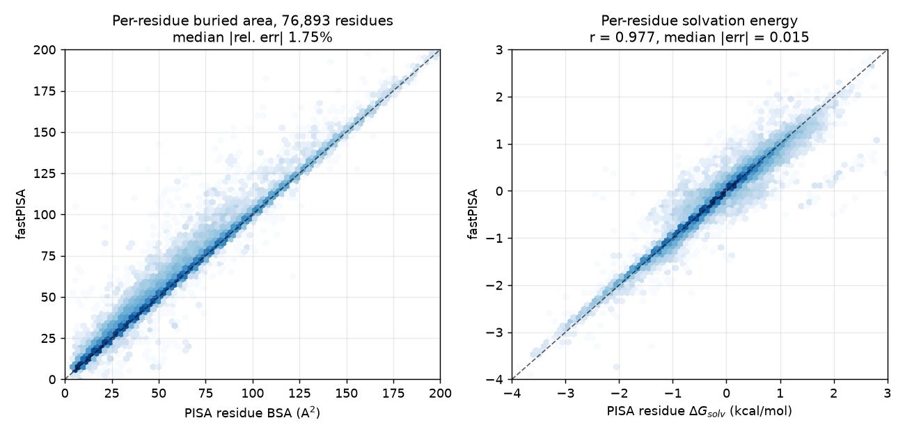
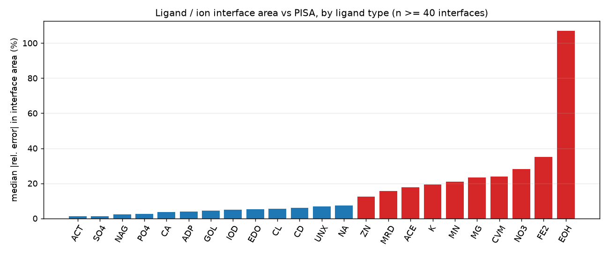
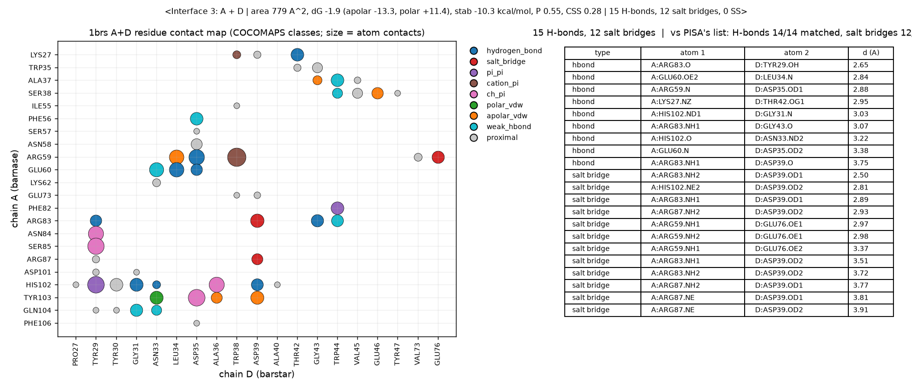

# fastPISA

Local, fast analysis of biomolecular interfaces — a Python reproduction of
[PISA](https://www.ebi.ac.uk/pdbe/pisa/) (Krissinel & Henrick 2007) calibrated
against the original engine, with a **COCOMAPS 2.0** contact-map mode. Reads
PDB **and mmCIF** files (including AlphaFold predicted complexes).

All modes run one shared analysis core, so they **always identify exactly the
same interfaces** for a structure.

| Mode | What it reports | Output |
|------|-----------------|--------|
| `combined` *(default)* | One unified report per interface: PISA thermodynamics **and** the COCOMAPS contact map | PISA schema + `interface_contact_map` per interface |
| `pisa` | Thermo/surface analysis: ASA/BSA, interface areas, ΔG, P-value, CSS, H-bonds / salt bridges / disulfides | PDBe PISA `assembly.json` + `interfaces.json` |
| `cocomaps` | Residue–residue contact map with atomic interaction-type classification (H-bond, salt bridge, pi-pi, cation-pi, ch-pi, …) | Superset of the PISA schema + `interface_contact_map` per interface |

## How it compares to PISA

fastPISA is calibrated against the original PISA engine on **674 PDB entries /
6,915 interfaces / 119k interface residues** (400 entries a seeded random draw
from a stated sampling frame, de-duplicated at 30% sequence identity; 36 legacy
hand-picked). It uses PISA's own conventions where they could be recovered —
the NACCESS/Chothia surface radii, per-element ion radii read off PISA's own
lone-ion surfaces, a per-atom-type solvation model fitted to PISA's
per-residue solvation energies — and reports every number below by **grouped
10-fold cross-validation** (no fold is scored on an entry it was fitted on).



| Quantity (vs original PISA) | Polymer–polymer (n=2,314) | All interfaces incl. ligands/ions (n=6,915) |
|---|---|---|
| Interface area | median rel. error **1.8%** (1.5% > 300 Ų) | 3.4% (ligand pairs 6.0%) |
| Per-residue buried area | median rel. error **1.75%** (119k residues) | — |
| Solvation ΔG | **r 0.987**, R² about 1:1 **0.975**, median error **0.33 kcal/mol**, slope 0.98 | r 0.956, R² 0.914, median 0.76 |
| Stabilization energy | r 0.996 (per-bond constants recovered exactly) | — |
| Hydrophobicity P-value | median error **0.060**, Spearman **0.88** | Spearman 0.38 |
| CSS | Spearman 0.75 (calibrated surrogate) | Spearman 0.64 |
| H-bond atom pairs | precision **0.958** / recall **0.952** against PISA's own bond list | — |
| Salt-bridge atom pairs | precision 0.985 / recall 0.979 | — |
| Disulfides | exact | — |



Every interface also carries the **hydrophobic / polar split** of ΔG
(`solvation_energy_apolar` = carbon + sulfur burial, `solvation_energy_polar` =
the rest; they sum to `solvation_energy`). PISA has no separate hydrophobic
contact list — its hydrophobic term *is* this favourable burial.

**Where it is weaker, stated plainly.** Ligand / ion interfaces are less
accurate than chain pairs. Oxo-anions, halides, Na⁺/Ca²⁺ and organic ligands
now agree to within a few percent in area, but transition metals with short
coordination bonds (Mg, Mn, Fe, Cu, and to a lesser extent Zn) are still
buried 12–35% more than PISA buries them, and no radius or neighbour rule we
tested reproduces PISA there. Treat those energies as indicative.



Contact maps and bond lists come out of the same run. Below: the barnase–barstar
interface (1brs A+D), COCOMAPS-classified residue contacts on the left, the
H-bond / salt-bridge atom pairs on the right, cross-checked against PISA's
list for the same interface.



Regenerate every figure and number offline with `python examples/make_figures.py`
and `python examples/calibrate.py` from the committed tables in
`tests/data/calibration/`.

**Speed** (single core, FreeSASA backend, `combined` mode = PISA energetics
*and* the contact map):

| atoms | molecules | interfaces | time |
|---|---|---|---|
| 1,784 | 4 | 5 | 0.4 s |
| 4,062 | 16 | 27 | 0.7 s |
| 11,550 | 6 | 7 | 1.0 s |
| 58,000 (GroEL/ES, 21 chains) | 21 | 70 | ~7 s |

**Validated against COCOMAPS 2.0** (the actual standalone tool, Zenodo
`10.5281/zenodo.17390665`, run on the same inputs with REDUCE-added
hydrogens): the residue–residue **contact map is identical** on all tested
complexes — protein–protein (1ktz, 30/30 pairs), antibody–antigen (1vfb
VH–lysozyme, 28/28) and protein–DNA (1aay zinc-finger, 57/57) — with
identical interface residue sets, and COCOMAPS-convention salt bridges
(including Lys/Arg–DNA-phosphate) matching per residue pair. Interaction
classes follow COCOMAPS 2.0 conventions (vdW contacts within r₁+r₂+0.5 Å,
"proximal" beyond, ring-geometry-validated π classes); the residual
differences are H-dependent classes (their H-bonds come from HBPLUS, their
weak C–H bonds use explicit-H angles), pinned in
`tests/test_vs_cocomaps2.py`.

---

## Install

```bash
cd fastPISA
pip install -e .

# Optional but recommended: C-accelerated ASA backend (~15x faster)
pip install freesasa numpy scipy
#   - numpy, scipy: always required
#   - gemmi: required for mmCIF parsing
#   - freesasa: C library; Shrake-Rupley SASA in C. Installed wheels use
#     gcc to compile the C library with Python bindings.
```

Dependencies: `numpy`, `scipy` (core); `gemmi` (mmCIF); `freesasa` (fast ASA, optional).

If `freesasa` is not installed, fastPISA automatically falls back to the pure-Python
Shrake-Rupley implementation.

---

## Quick start (CLI)

```bash
python -m fastpisa.cli 6nxr.pdb --pdb_id 6nxr --output_dir out            # combined (default)
python -m fastpisa.cli complex.cif --mode pisa --pdb_id my --time --json-summary -o out
```

Common options:

| Flag | Meaning |
|------|---------|
| `--mode {combined,pisa,cocomaps}` | Analysis mode (default `combined`) |
| `--pdb_id` | PDB id used in output filenames |
| `--probe_radius`, `--point_density`, `--interface_cutoff` | Core geometry knobs |
| `--no-water` / `--with-water` | Exclude (default) or include ordered water in the interface search |
| `--ligand-mode {separate,merge}` | `separate` (default): each bound hetero group is its own monomer, classic PISA. `merge`: a chain's ligands/cofactors count toward that chain's interfaces (jsPISA assembly convention) |
| `--time` | Print wall-clock analysis time |
| `--json-summary` | Print a compact JSON summary instead of the text report |
| `-o`, `--output_dir` | Where to write the two JSON documents |

Output files per run:

```
{pdb_id}-assembly{assembly_id}-interfaces.json   # per-interface detail
{pdb_id}-assembly{assembly_id}.json              # assembly-level stats
```

---

## Python API

```python
import fastpisa

res = fastpisa.analyze("complex.pdb")        # PDB or mmCIF; AlphaFold models fine
res                                          # readable summary of every interface
# <fastPISA complex: 3 interfaces (combined mode)>
#   <Interface 1: A + B | area 779 A^2, dG -1.9 (apolar -13.3, polar +11.4), stab -10.3 kcal/mol,
#    P 0.55, CSS 0.28 | 15 H-bonds, 12 salt bridges, 0 SS>
#   ...

iface = res.interface_between("A", "B")     # or res[0], or `for iface in res:`
iface.interface_area, iface.solvation_energy, iface.stabilization_energy
iface.solvation_energy_apolar, iface.solvation_energy_polar   # hydrophobic / polar parts
iface.p_value, iface.css

for hb in iface.hydrogen_bonds:              # AtomContact objects; also .salt_bridges, .disulfides
    print(hb.label)                          #  A:ARG83.O -- D:TYR29.OH  2.65 A
iface.bonds_dataframe()                      # pandas: chain/residue/seq/atom x2, distance, type

iface.contact_map                            # COCOMAPS residue-residue map (list of dicts)
iface.contact_map_dataframe()                # ... as pandas
iface.interaction_population                 # {'hydrogen_bond': 15, 'salt_bridge': 12, 'ch_pi': ...}
iface.residues(side=1)                       # interface residues with ASA / BSA / dG each

res.to_dataframe()                           # one row per interface
res.hot_spot_residues(top_n=10)              # residues burying the most area
res.write_json("out/")                       # PDBe-PISA-shaped JSON (+ contact maps)
```

Options go through the same call: `fastpisa.analyze(path, mode="pisa")`
(energetics only, fastest), `mode="cocomaps"`, `ligand_mode="merge"` (cofactors
belong to their chain, the jsPISA-on-assembly convention), `min_css=0.5`.
The full class is `fastpisa.api.PISAInterfaceAnalyzer` (same object
`analyze()` returns) and the legacy one-shot `analyze_interface()` still works.

Visualisation helpers in `fastpisa.viz`: `plot_contact_heatmap`,
`write_pymol_script`, `write_molstar_html`; a contact-map figure like the one
above is `examples/make_figures.py::fig_contact_map`.

---

## Worked example — analyze a PDB and visualize an interface

`tests/data/1ktz.pdb` is a small two-chain (A/B) complex — a good first run.

CLI:

```bash
# combined mode (default) -> PISA thermodynamics + COCOMAPS contact map
python -m fastpisa.cli tests/data/1ktz.pdb --pdb_id 1ktz -o out --hotspots 5
```

```text
=== Summary ===
Mode: combined
Interfaces found: 1
Assembly dissociation energy: 30.92
Total ASA: 11576.73
Total BSA: 541.13

Top 5 hotspot residues (by buried area):
  A94 (ARG) BSA=83.4 A^2  interfaces=[1]
  B53 (ILE) BSA=81.9 A^2  interfaces=[1]
  A91 (TYR) BSA=75.6 A^2  interfaces=[1]
  A31 (LYS) BSA=70.2 A^2  interfaces=[1]
  A93 (GLY) BSA=66.5 A^2  interfaces=[1]

  Interface 1: 30 residue pairs
    Interaction population: {'hydrogen_bond': 6, 'salt_bridge': 10,
    'weak_hbond': 22, 'polar_vdw': 101, 'ch_pi': 73, 'apolar_vdw': 58, 'cation_pi': 6}
```

For 1ktz's A–B interface original PISA reports area 493.4 Ų, ΔG −4.3
kcal/mol, P-value 0.50, 9 H-bonds, 8 salt bridges; fastPISA gives 483.5 Ų,
−3.3 kcal/mol, P-value 0.52, 9 H-bonds, 8 salt bridges on the same input.

Python — introspect the interfaces and write visualizations in one go:

```python
from fastpisa.api import PISAInterfaceAnalyzer

ana = PISAInterfaceAnalyzer("tests/data/1ktz.pdb", pdb_id="1ktz", mode="cocomaps")
ana.analyze()

for iface in ana.interfaces:
    m1, m2 = iface.molecules
    print(f"interface {iface.interface_id}: {m1['molecule_class']} {m1['auth_asym_id']} "
          f"<-> {m2['molecule_class']} {m2['auth_asym_id']}")
    print(f"  area={iface.interface_area:.1f} A^2  hbonds={iface.number_hydrogen_bonds} "
          f"salt={iface.number_salt_bridges}")

# --- visualization ---
ana.write_pymol_script("1ktz_iface.pml")    # color interface residues by BSA (blue->red)
ana.write_molstar_html("1ktz_iface.html")   # self-contained 3D Mol* viewer (open in a browser)
ana.plot_contact_heatmap(1, out_path="1ktz_cmap.png")  # residue contact heatmap (needs matplotlib)

print(ana.hot_spot_residues(top_n=5))       # top buried residues across interfaces
```

- `1ktz_iface.pml`: `pymol 1ktz_iface.pml` opens the model with the interface
  residues coloured by buried surface area.
- `1ktz_iface.html`: a standalone Mol* viewer (loads Molecule from CDN on first
  open) with interface residues as ball-and-stick.
- `1ktz_cmap.png`: a residue-residue contact-count heatmap (requires
  `pip install fastpisa[viz]`).

Confidence from existing B-factors (works for any AlphaFold/ColabFold/Protenix
model, no JSON needed):

```python
ana = PISAInterfaceAnalyzer("tests/data/1ktz.pdb", pdb_id="1ktz", mode="pisa")
ana.analyze()
ana.load_plddt()                    # read pLDDT from the B-factor column
print(ana.model_plddt())            # overall model confidence
print(ana.plddt_scores())           # mean interface pLDDT
ana.filter_by_plddt(min_plddt=70.0) # keep confident interfaces only
```

---

## Interface Explorer app (Streamlit) — manuscript digests

`app/streamlit_app.py` turns a structure plus a **chain-group selection**
(e.g. antigen vs. antibody H+L) into the numbers a paper needs for the
interface *between the groups*:

- buried surface **per side** and in total ("buries 820 Ų on the antigen"),
  interface area in the PISA convention;
- ΔG solvation with its hydrophobic / polar split, stabilisation energy;
- hydrogen bonds, salt bridges, disulfides (PISA rules) and COCOMAPS contact
  classes; the epitope / paratope residue lists with BSA and ΔG each;
- a contact-map figure and a residue bar plot (PNG/SVG), ChimeraX / PyMOL
  selections, a 3D view;
- Excel / CSV / JSON export and a **Results paragraph + Methods text** to
  paste into the manuscript.

```bash
pip install -r app/requirements.txt
streamlit run app/streamlit_app.py
```

Deploy on Streamlit Community Cloud with main file `app/streamlit_app.py`.
The same digest is a plain Python API:

```python
from fastpisa.report import group_interface
gi = group_interface(res, ["A"], ["H", "L"], "antigen", "Fab")
gi.buried_side1, gi.n_hbonds, gi.residue_string(1)     # epitope as R59, H102, ...
gi.results_paragraph(); gi.bonds_table(); gi.chimerax_command()
```

---

## Batch analysis (`fastpisa.batch`)

Analyse many structures (e.g. AlphaFold antibody–antigen complexes) in one call,
optionally in parallel — no extra dependency (`concurrent.futures`).

```python
from fastpisa.batch import analyze_many, expand_inputs

files = expand_inputs("models/*.cif", "/path/to/a_database")
for r in analyze_many(files, mode="pisa", n_jobs=4):
    print(r["path"], r["ok"], r["n_interfaces"], r["error"])
```

`expand_inputs` expands globs / scans directories for `.pdb`/`.cif`/`.cif.gz`.
`analyze_many` returns one dict per input `{path, ok, result, n_interfaces, error}`
in the same order; a single bad file never aborts the batch. Use `n_jobs=1`
(serial) for < ~10 files and `n_jobs>1` (process pool) for larger batches.

A complete worked example lives at `examples/batch_analyze.py`:

```bash
python examples/batch_analyze.py "results/**/*.cif" -o out.jsonl --n_jobs 4
```

---

## AlphaFold confidence filtering (PAE / ipTM)

AlphaFold models ship a `*_predicted_aligned_error.json` (a residue×residue PAE
matrix plus the global `iptm`/`ptm`). fastPISA can rank and filter interfaces by
how confidently they are predicted — the standard check for whether an AlphaFold
interface is real.

```python
from fastpisa.api import PISAInterfaceAnalyzer

ana = PISAInterfaceAnalyzer("complex.cif", mode="pisa")
ana.analyze()
ana.load_pae("complex_predicted_aligned_error.json")

print(ana.pae_scores())          # mean PAE (A) per interface, lower = more confident
ana.filter_by_pae(max_pae=5.0)   # keep only interfaces with mean PAE <= 5 A
ana.filter_by_iptm(min_iptm=0.8) # drop all interfaces if model ipTM < 0.8
```

CLI: `python -m fastpisa.cli complex.cif --pae complex_..._error.json --min-pae 5.0 --min-iptm 0.8`.

### Portable confidence from B-factors (pLDDT)

The PAE JSON above is only emitted by Protenix-style pipelines; most predictors do not
produce it. The broadly-applicable confidence signal is the **per-residue pLDDT in the
B-factor column**, which AlphaFold, ColabFold and Protenix all write into the model
(0-100, higher = more confident). No extra file is needed.

```python
ana.load_plddt()                    # read pLDDT from B-factors
print(ana.model_plddt())            # overall model confidence
print(ana.plddt_scores())           # mean interface pLDDT, higher = more confident
ana.filter_by_plddt(min_plddt=70.0) # keep interfaces whose mean pLDDT >= 70
```

CLI: `python -m fastpisa.cli complex.cif --min-plddt 70.0`. Raises a clear `ValueError`
if the model's B-factors are constant (no confidence signal).

---

## Visualisation (`fastpisa.viz`)

Three ways to look at an interface (item 4.3):

```python
from fastpisa.api import PISAInterfaceAnalyzer
ana = PISAInterfaceAnalyzer("6nxr.pdb", mode="cocomaps")
ana.analyze()
iface = ana.interfaces[0]

ana.write_pymol_script("iface.pml")             # colour interface residues by BSA
ana.write_molstar_html("iface.html")            # self-contained Mol* 3D viewer
ana.plot_contact_heatmap(1, out_path="cmap.png")# matplotlib residue-contact heatmap
```

CLI equivalents: `--pymol-script out.pml`, `--molstar out.html`, `--heatmap cmap.png`,
and `--hotspots N` prints the top-N buried residues. The matplotlib heatmap needs
`pip install fastpisa[viz]`; PyMOL-script and Mol* HTML need no extra deps.

---

## What's new in 0.4.0

- **Calibrated on 674 sampled PDB entries, at residue level.** The 36-entry
  hand-picked benchmark is replaced by a seeded random draw from a stated
  sampling frame (30% identity de-duplicated); every accuracy figure is
  grouped cross-validated. PISA's per-residue solvation energies (119k
  residues) fit a 32-class + per-atom-type solvation model; polymer ΔG
  median error 1.0 → 0.33 kcal/mol.
- **PISA's own surface conventions recovered**: NACCESS/Chothia radii
  (sp2/sp3 carbon distinguished), per-element ion radii read off PISA's
  lone-ion surfaces. Per-residue buried area error 6.1% → 1.75%; ligand
  interface area 12% → 6%.
- **Atom-level bond audit** against PISA's H-bond / salt-bridge lists
  (`fastpisa/reference/bonds_audit.py`): precision/recall 0.96/0.95 and
  0.985/0.98. Fixed a parser bug that collapsed negative residue numbers
  onto 0.
- **Hydrophobic / polar split** of the solvation energy on every interface.
- **Pythonic API**: `fastpisa.analyze()`, iterable results, readable
  `repr`, `iface.hydrogen_bonds` / `.salt_bridges` / `.contact_map` /
  `.residues()` / DataFrame helpers, `res.interface_between("A", "B")`.
- **Reproducible calibration**: `examples/calibrate.py` refits every
  constant from committed tables; a test fails if the shipped constants
  drift from the data. README figures from `examples/make_figures.py`.

## What's new in 0.3.0

- **One shared analysis core** (`fastpisa/core.py`): all modes run the same
  physics once; `combined` mode (new default) delivers PISA thermodynamics
  *and* the COCOMAPS contact map in a single report.
- **Numerical parity with original PISA**: PISA interface semantics
  (buried-area-based detection), pair-specific buried surfaces, heavy-atom
  surfaces, geometric H-bond detection, ASP table + P-value + CSS calibrated
  against the EBI PISA engine (262 interfaces, 36 entries), PISA's per-bond
  energy constants recovered exactly (−0.444/−0.150/−4.0 kcal/mol).
- **COCOMAPS 2.0-faithful contact maps**: identical residue-pair maps
  (validated against the actual COCOMAPS 2.0 tool), ring-geometry-validated
  π classes, COCOMAPS conventions for salt bridges (incl. DNA phosphates),
  vdW/proximal/clash classes, full per-pair class breakdowns.
- **Faster**: local-delta per-pair surfaces, vectorised masks; GroEL/GroES
  (58k atoms, 70 interfaces) in ~7 s with FreeSASA.
- New: `ligand_mode="merge"`, `.pdb.gz` input, PDBe PISA 2.0 assembly
  comparison (`--assembly-entries`), offline accuracy regression tests, CI.

## Validation & benchmark vs original PISA

**Ground truths used** (all comparisons reproducible from this repo):

1. **Classic EBI PISA engine** — XML from
   `https://www.ebi.ac.uk/pdbe/pisa/cgi-bin/interfaces.pisa?<id>` for 674
   entries (identity/ASU interfaces; per-interface energetics, per-residue
   ASA/BSA/ΔG and the atom-level bond lists). The 36 legacy entries are
   cached in `tests/data/reference/`; the 400 sampled entries are distilled
   into `tests/data/calibration/` (sampling frame and seed:
   `fastpisa/reference/sampling.py`, entry list `entries.json`). Drives the
   calibration, `tests/test_calibration_benchmark.py` (out-of-sample) and
   `tests/test_vs_pdbe_pisa.py` (in-sample regression).
2. **PDBe PISA 2.0 JSON API** (biological assemblies; covers recent
   entries) — blind test on 20 depositions from 2023–2024, fastPISA run on
   the same assembly coordinates.
3. **COCOMAPS 2.0 standalone code** (Zenodo `10.5281/zenodo.17390665`) run
   locally on the same inputs; its residue-pair tables are cached in
   `tests/data/reference/cocomaps2/` and pinned by
   `tests/test_vs_cocomaps2.py`.

Accuracy: `python examples/compare_vs_pisa.py` runs the full head-to-head
against the original PISA engine (EBI PDBe PISA service; XML + PDB files
cached under `tests/data/reference/`, so it works offline) and prints the
agreement table shown at the top of this README. The same numbers are pinned
as a regression test in `tests/test_vs_pdbe_pisa.py`. `--fetch <pdbid> ...`
extends the benchmark with new entries (network required once).

Speed (with the FreeSASA C backend): typical complexes take 0.2–1 s (table
above); GroEL/GroES (1aon: 58k atoms, 21 chains, 70 interfaces) takes ~7 s in
combined mode. fastPISA is ~3–4x faster than the original CCP4 binary on
comparable inputs and ~15x faster than its own pure-Python fallback. Per-pair
surfaces are computed only near each interface, so runtime scales with
interface count and local size, not with (chains)² × structure size.

Note on interface *counts*: original PISA run on a crystal entry also reports
symmetry-mate (crystal packing) interfaces; fastPISA reports the interfaces
present in the given coordinate set (the identity/ASU interfaces — everything
an AlphaFold/cryo-EM model has). Comparisons therefore match on identity
interfaces, which is a documented scope decision, not a bug.

---

## Layout

```
fastpisa/
├── core.py                # THE shared analysis core (all modes run this once)
├── api.py                 # PISAInterfaceAnalyzer class + analyze_interface()
├── cli.py                 # command-line interface
├── pipeline.py            # PISA-mode entry point (thin wrapper over core)
├── pae.py                 # AlphaFold PAE / ipTM reading + interface filtering
├── viz.py                 # PyMOL script / matplotlib heatmap / Mol* HTML
├── batch.py               # parallel batch analysis (analyze_many)
├── cocomaps/              # COCOMAPS 2.0 mode
│   ├── interactions.py    # atomic interaction-type classifier
│   ├── rings.py           # ring centroids/normals for pi-class geometry
│   ├── contact_map.py     # residue-residue contact map + matrix
│   └── pipeline.py        # COCOMAPS-mode entry point (thin wrapper over core)
├── interface/
│   ├── contacts.py        # molecule detection, masks, contacts (shared)
│   └── bonds.py           # geometric H-bond / salt-bridge / disulfide detection
├── surface/
│   ├── shrake_rupley.py   # pure-Python Shrake-Rupley ASA
│   └── freesasa_backend.py# optional C-accelerated ASA (auto-dispatched)
├── energy/                # PISA-calibrated ASP table, ΔGsolv, bond energies
├── scoring/               # PISA-definition P-value, calibrated CSS
├── reference/             # EBI PISA reference fetching + comparison harness
├── output/                # PDBe PISA JSON builders
└── parser/pdb_parser.py   # PDB(.gz) + mmCIF parsing (gemmi)
```

---

## Notes / caveats

- **Calibration scope**: the ΔG/P-value/CSS calibration was fitted on the
  21-entry EBI benchmark (leave-one-PDB-out validated). Single-ion interfaces
  (a lone Zn²⁺/Ca²⁺) carry the largest relative ΔG errors — PISA uses
  ion-specific desolvation terms that fastPISA approximates with one metal
  class. CSS is a calibrated surrogate: exact CSS requires PISA's crystal-wide
  assembly analysis.
- **ASA/BSA convention**: with the FreeSASA backend, absolute ASA/BSA values use
  FreeSASA's parameters; with the pure-Python backend they use our 480-point
  convention. Values differ slightly between the two backends, but interface
  *detection* is identical. Explicit hydrogens are excluded from all surfaces
  (the PISA convention) but are used for H-bond geometry when present.
- **Symmetry**: crystal-symmetry (packing-mate) interface enumeration and
  biological-assembly prediction are not implemented (see benchmark note).
- **COCOMAPS classifier** is a rule-based subset of COCOMAPS 2.0's 16 interaction
  classes; H-bonds share fastPISA's geometric detector, but it does not run
  HBPLUS or add hydrogens.

## License

Original PISA is (C) Eugene Krissinel (CCP4) — see the CCP4 license. This
reimplementation is provided for research use.